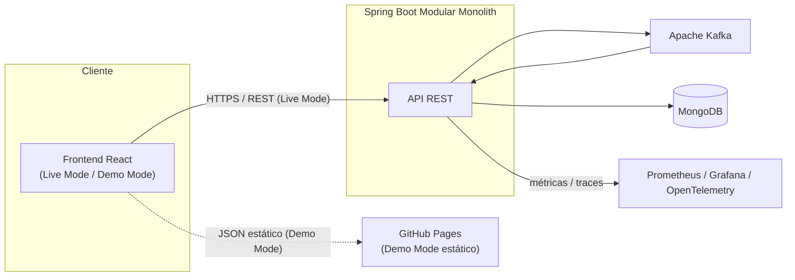
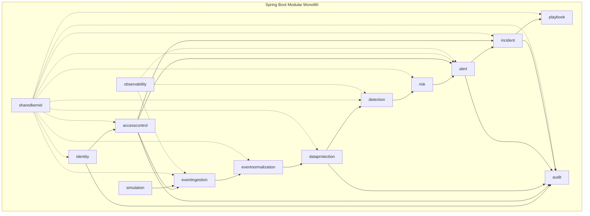
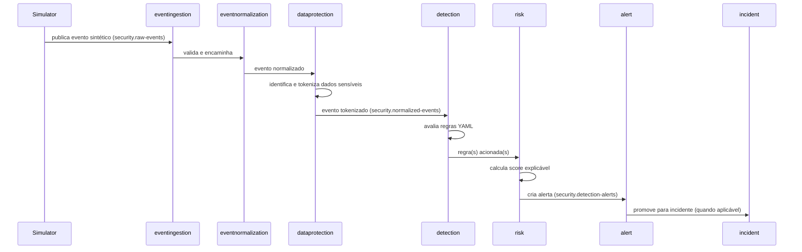
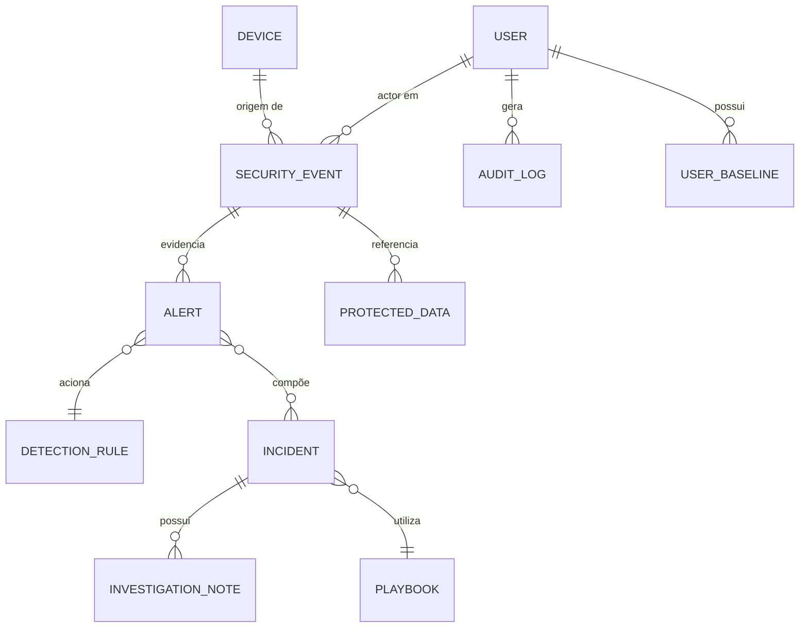

# Arquitetura — CoopShield SOC

> **Aviso:** Projeto independente, educacional e de portfólio. Todos os dados, eventos e
> cenários referenciados nesta arquitetura são sintéticos.

## 1. Estilo Arquitetural

CoopShield SOC adota, no MVP, um **monólito modular orientado a eventos**, estruturado
internamente com **arquitetura hexagonal** (portas e adaptadores) e princípios de
**Domain-Driven Design (DDD)**. A justificativa completa está registrada em
[ADR-001](../adr/ADR-001-monolito-modular.md) e [ADR-009](../adr/ADR-009-arquitetura-hexagonal.md).

Motivações:

- Reduz a complexidade operacional do MVP (um único deploy, um único banco de dados,
  uma única pipeline) sem abrir mão de limites de domínio bem definidos.
- Cada módulo é internamente organizado em `domain` (regras de negócio, sem dependência
  de framework), `application` (casos de uso/portas) e `infrastructure` (adaptadores:
  REST, Kafka, MongoDB).
- Os módulos se comunicam por interfaces explícitas e por eventos internos/Kafka, nunca
  por acesso direto a repositórios de outro módulo — o que permite, no futuro, extrair
  um módulo para um microsserviço próprio sem reescrever sua lógica de domínio.

## 2. Diagrama de Contexto

## 3. Diagrama de Módulos (Monólito Modular)

`sharedkernel` fornece tipos e contratos comuns (ex.: `EventEnvelope`, `CorrelationId`,
`RiskFactor`) e não depende de nenhum outro módulo. `observability` observa os demais
módulos de forma transversal (métricas/tracing), sem participar do fluxo de negócio.

## 4. Fluxo Orientado a Eventos

## 5. Módulos do Backend

| Módulo | Responsabilidade |
|--------|--------------------|
| `identity` | Autenticação, usuários, refresh tokens, política de senha e bloqueio |
| `accesscontrol` | Autorização por perfil (RBAC), verificação de permissões nos demais módulos |
| `eventingestion` | Recepção e validação inicial de eventos brutos (API/Kafka) — real desde a Fase 4 |
| `eventnormalization` | Normalização de eventos para o modelo comum — real desde a Fase 4 |
| `dataprotection` | Classificação, tokenização, mascaramento e controle de destokenização |
| `detection` | Carregamento de regras YAML e avaliação contra eventos normalizados |
| `risk` | Cálculo de pontuação de risco explicável |
| `alert` | Ciclo de vida de alertas |
| `incident` | Ciclo de vida de incidentes, evidências, linha do tempo |
| `playbook` | Catálogo de playbooks defensivos simulados e execução de ações simuladas |
| `audit` | Trilha de auditoria de ações sensíveis e privilegiadas |
| `observability` | Métricas, health checks, correlação de logs |
| `simulation` | Geração de personagens, cenários e eventos sintéticos |
| `sharedkernel` | Tipos, contratos e utilitários comuns entre módulos |

## 6. Limites de Domínio

- Nenhum módulo acessa a coleção MongoDB de outro módulo diretamente; todo acesso
  cruzado ocorre via interface de aplicação (porta) exposta pelo módulo dono do dado.
- `dataprotection` é a única fronteira autorizada a tokenizar/destokenizar; nenhum outro
  módulo implementa lógica própria de proteção de dados.
- `detection` e `risk` são desacoplados: `detection` decide *que* regra foi acionada,
  `risk` decide *quanto* de risco isso representa — permitindo evoluir o cálculo de
  risco (ex.: futura integração estatística/UEBA) sem alterar as regras.
- `audit` recebe eventos de auditoria dos demais módulos via uma porta comum
  (`AuditPort`), nunca lendo diretamente o estado interno de outro módulo.
- `simulation` depende apenas da porta pública de `eventingestion`; não tem acesso
  privilegiado a nenhum outro módulo.

## 7. Modelo de Dados (visão conceitual)

O modelo de dados é construído incrementalmente: cada fase cria as coleções, índices e
estratégias de retenção do(s) módulo(s) de domínio que ela implementa, seguindo o
padrão de adaptador MongoDB estabelecido na Fase 3
([ADR-012](../adr/ADR-012-mongodb-real-fase-3.md)). Na Fase 3, as coleções `users`,
`refresh_tokens` (módulo `identity`) e `audit_logs` (módulo `audit`) já existem e são
reais; as demais aparecem no diagrama conceitual abaixo mas só passam a existir como
coleções MongoDB quando seus módulos donos forem implementados (ver tabela de fases em
ADR-012).

Entidades principais (detalhamento completo na Fase 3): `User`, `Role`,
`SecurityEvent`, `Alert`, `Incident`, `InvestigationNote`, `DetectionRule`, `Playbook`,
`AuditLog`, `ProtectedData`, `UserBaseline`, `Device`, `RefreshToken`, `SimulationRun`.

## 8. Modo Demo vs. Modo Live

Ver [ADR-007](../adr/ADR-007-demo-live-mode.md) para a decisão completa. Resumo:

- **DEMO_MODE**: front-end estático publicado no GitHub Pages, consumindo arquivos JSON
  sintéticos versionados no repositório; não depende de backend, Kafka ou MongoDB; não
  contém segredos.
- **LIVE_MODE**: front-end consumindo a API Spring Boot real, com autenticação,
  ingestão via Kafka e persistência em MongoDB; usado na execução local via Docker
  Compose.

## Documentos Relacionados

- [Estrutura do Repositório](repository-structure.md)
- [Perfis e Permissões](roles-permissions.md)
- [Riscos Técnicos](technical-risks.md)
- [ADRs](../adr/)
- [Roadmap](../roadmap.md)
